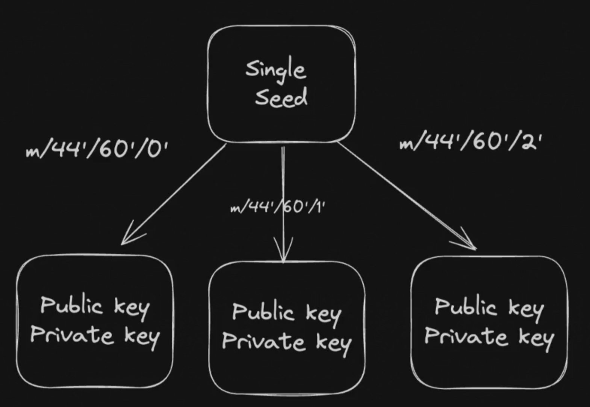

## Web Wallet
- Hierarchical Deterministic (HD) wallets are a type of wallet that can generate a tree of key pairs from a single seed.  This allows for the generation of multiple addresses from a single root seed, providing both security and convenience.
 
**A simple web based wallet where someone can come and create a pneumonic, add multiple wallets and see the public key associated with each wallet**
- Seed Phrase => Derivation Paths (Multiple wallets)

m: Refers to the master node, or the root of the HD wallet.
purpose: A constant that defines the purpose of the wallet (e.g., 44' for BIP44, which is a standard for HD wallets).
coin_type: Indicates the type of cryptocurrency (e.g., 0' for Bitcoin, 60' for Ethereum, 501' for solana).
account: Specifies the account number (e.g., 0' for the first account).
change: This is either 0 or 1, where 0 typically represents external addresses (receiving addresses), and 1 represents internal addresses (change addresses).
address_index: A sequential index to generate multiple addresses under the same account and change path.

## Deterministic wallet
From same pnemonic same key generation